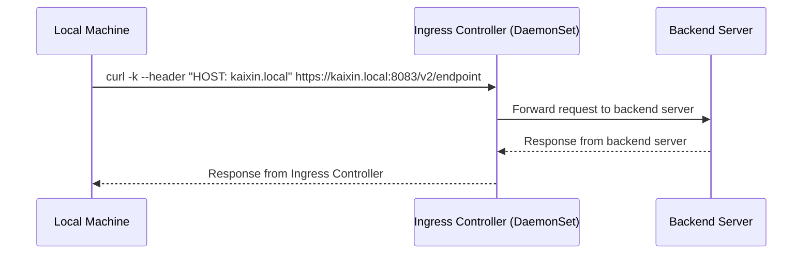
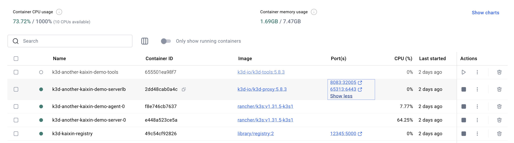
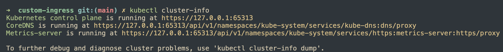

## Simple ingress controller

### Overview

This is a simple ingress controller for Kubernetes. It watches for Ingress resources and creates a corresponding mapping rule to forward requests.



### k3d

This setup uses [k3d](https://k3d.io/stable/) to create a local k8s cluster. Each docker container is a node in k8s cluster.  
Install k3d using the following command:

```bash
k3d registry create kaixin-registry --port 12345
k3d cluster create --registry-use k3d-kaixin-registry:12345 -p "8083:32005@loadbalancer" another-kaixin-demo --agents 1
```

Here is the k8s cluster created by k3d:




### Build and run

```bash
docker build -f ./deployment/Dockerfile -t kaixin-registry:12345/gateway:v1.0 .
docker push kaixin-registry:12345/gateway:v1.0

kubectl apply -f ./deployment/deployment-app.yaml
kubectl apply -f ./deployment/deployment-ingress-controller.yaml
kubectl apply -f ./deployment/ingress.yaml
```

Test the ingress controller

```bash
curl -k --header "HOST: kaixin.local" https://kaixin.local:8083/v2/endpoint
curl -k --header "HOST: another.local" https://another.local:8083/v2/endpoint
```


### Generate self-signed certificate

```bash
openssl genrsa -out ca.key 2048
openssl req -x509 \
  -new -nodes  \
  -days 10000 \
  -key ca.key \
  -out ca.crt \
  -subj "/CN=kaixin.local"
```
Create k8s secret

```bash
kubectl create secret tls tls-cert \
--key ca.key \
--cert ca.crt
```
## References

- [How To Call Kubernetes API using Simple HTTP Client](https://iximiuz.com/en/posts/kubernetes-api-call-simple-http-client/)
- [How to Build a Custom Kubernetes Ingress Controller in Go](https://www.doxsey.net/blog/how-to-build-a-custom-kubernetes-ingress-controller-in-go/)