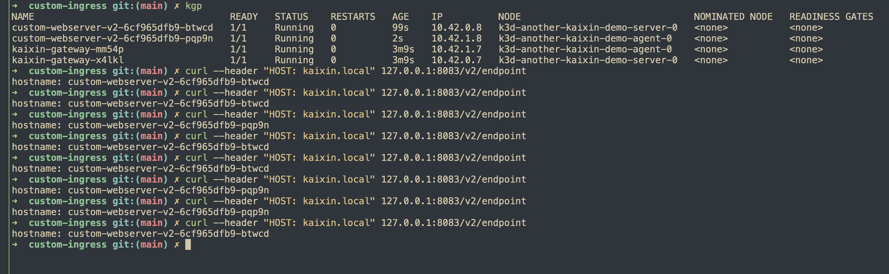

## Simple ingress controller

```bash
docker build -f ./deployment/Dockerfile -t kaixin-registry:12345/gateway:v1.0 .
kubectl apply -f ./deployment/deployment-app.yaml
kubectl apply -f ./deployment/deployment-ingress-controller.yaml
kubectl apply -f ./deployment/ingress.yaml
```

Test the ingress controller

```bash
curl --header "HOST: kaixin.local" 127.0.0.1:8083/v2/endpoint
```


## References

- [How To Call Kubernetes API using Simple HTTP Client](https://iximiuz.com/en/posts/kubernetes-api-call-simple-http-client/)
- [How to Build a Custom Kubernetes Ingress Controller in Go](https://www.doxsey.net/blog/how-to-build-a-custom-kubernetes-ingress-controller-in-go/)